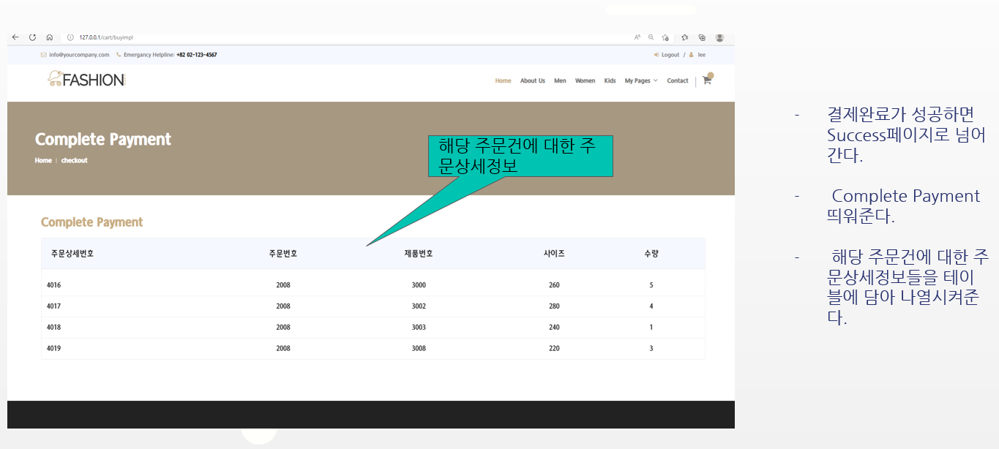

# Team2-Nice(Shoes ShoppingSite)

<aside>
🖐️ 2조 : 김민식, 서예린, 안원영 유정아
</aside>

| 🗣️**언어**         | 🕸️**웹**                                                      | 🛠️**개발도구** | 💽**DataBase** | 🔱**협업도구**                                                | :framed_picture:**Framework** |
| ----------------- | ------------------------------------------------------------ | ------------- | ------------- | ------------------------------------------------------------ | ----------------------------- |
| **Java**  **SQL** | **HTML5**    **CSS3**    **JS**    **JQuery**    **Ajax**   **BootStrap** | **Eclipse**   | **Mysql**     | **Zoom**  **[Github](https://github.com/minsiks/Team2-Semi_Project)**  **[ERDCloud](https://www.erdcloud.com/d/tBFT5AzhSeSA2sXz7)**  **[padlet](https://padlet.com/tidnjrk010/Bookmarks?utm_campaign=added_post&utm_medium=desktop&utm_source=notifications)**  **[Notion](Multi%20Cam%20%E1%84%89%E1%85%A6%E1%84%86%E1%85%B5%E1%84%91%E1%85%B3%E1%84%85%E1%85%A9%E1%84%8C%E1%85%A6%E1%86%A8%E1%84%90%E1%85%B3%20fbd4e75f041a459aa02c6051ca5e67fb.md)** | **SpringBoot**  **MyBatis**   |

## Nice(Shoes ShoppingSite) 프로젝트 관련 서류

[Semi project PPT 2조 - Google Slides](https://docs.google.com/presentation/d/1upFYaKb7vqLy3j93h6VlixmRY24de5CrrNheaTwdWNI/edit#slide=id.g137a636e1c6_2_92)

[세미프로젝트 기획안_2조 - Google Docs](https://docs.google.com/document/d/1WqOPMUecu_bIZjKxn7Id1JEbKF9EYZ1rMXDy0rece8U/edit)

---

## 역할분담

----

## 프로젝트 기획

| 프로젝트 주제 및 개요              | [나이키 온라인 공식 쇼핑몰 홈페이지](https://www.nike.com/kr/ko_kr/w/men/fw?utm_source=Google&utm_medium=PS&utm_campaign=365DIGITAL_Google_SA_Keyword_Extend_PC&cp=53055959389_search_&gclid=Cj0KCQjwwJuVBhCAARIsAOPwGASu1zlJTEmTBCrb0N4tZXo148-2hjVf16nR0uFm1gM0p62eoXTYAuAaAn5JEALw_wcB)를  참고하여 신발 쇼핑몰을 제작한다. 체크박스를 이용한 제품 사이즈와 색상필터링 검색기능, 회원가입기능, 장바구니기능, 결제 API기능을 구현하는 것이 목표이다. |
| ---------------------------------- | ------------------------------------------------------------ |
| 프로젝트 수행 방향  수행 방법/도구 | 1. 메뉴/기능별 세부사항    1) 구매 기능 : 무조건 카트에 넣어서 구매, 비회원구매 불가, API 활용,  결제 후 구매 정보를 확인   2) 제품 조회 기능 : 필터를 통해 특정 제품만  조회 (필터 중복체크 가능)   3) 제품 상세 페이지 : 리뷰 조회 및 리뷰  작성 가능   4) 로그인 / 회원가입 기능 : 아이디 기억, 자동로그인   5) 카트 기능 : 체크박스 활용하여 선택된  제품만 결제 가능   6) 고객센터 기능 : 이름, 이메일, 문의내용 입력 후  Add          2. 프로젝트 환경  및 도구                               3. 사이트  정보 구조도(I.A)     |

## ERD 구성

## 프로젝트 결과

## Header 

1. 로그인과 비 로그인에 따라 다르게 표시

   - 비 로그인시 Login / Register 가 표시 

     

   - 로그인시 Logout / UserName 표시

     

## Login (로그인 화면)

1. 로그인 버튼 클릭시 login 시 공백값 체크 후 공백이라면 해당 input에 알려주기 

2. 공백이 아니라면 controller에서 DataBase에 저장되어있는 ID와 Password가 맞는지 판단 후 맞다면 로그인, 아니라면 login 페이지로 이동. 이동 후 오류 message 표시

   

   

## Register (회원가입 화면)

- 

### 전체 Check

1. 공백인 경우 해당 칸에 "필수입력요소입니다." 를 표시 

   

### ID Check

1. blur( 포커스 벗어나면 실행 ) 시 Ajax를 이용해 Database에 있는 Id와 비교.  
   - 만약 Id가 존재한다면 "사용불가능한 ID"
   - ID가 존재하지 않는다면 "사용가능한 ID" 를 출력 

### Password Check

- Password 

  1. 포커스가 가기전에는 Password 조건을 표시하는 박스를 .hide() 를 사용하여 숨기고 포커스를 받을경우 Password 조건을 표시하는 박스를 .show() 를 사용하여 표시 

  2. Password 조건은 총 3가지로, 조건을 만족하면 초록색 글씨와 V 표시를, 조건을 만족하지 않는다면 빨간색 글씨와 X 표시로 나타낸다. 

  3. 사용 가능한 Password면 "사용할 수 있는 password입니다." 를 표시 

     

     

     

- Password 확인 

  1. 앞에서 작성한 Password와 동일한 값을 입력하면 "password와 같습니다. 이용가능 " 을 표시하고 동일하지 않다면 "password와 다릅니다. 다시입력해주세요. " 를 표시 

### TelPhone Check

1. 정규식을 사용하여 전화번호 형식 ( 010-1234-5678 ) 에 맞는지를 확인한다. 

   - 정규식으로 조건을 확인하고 전화번호 형식과 다르다면 "전화번호 형식에 맞지 않습니다. 010-1111-1111 형식으로 작성하세요, "를 표시 
   - 조건이 맞다면 "사용가능한 전화번호 형식입니다. " 를 표시 

2. Maxlength() 를 이용해 입력 글자수를 전화번호 자리수인 13자리로 제한했다.

   

- 가입성공시 자동 로그인. 만약 회원가입 조건 1개라도 만족하지 않을 시 submit이 발생하지 않는다. 

## MyPage

- 로그인한 경우만 이용할 수 있도록 구성. 

  

- 로그인한 id를 이용해 mypage의 값들을 표시한다. 

### 주문내역 / 배송현황

- 로그인된 id로 주문한 물품을 표시한다. 1개의 주문번호에는 여러개의 결재내용( buy_detail ) 이 들어갈 수 있다. 

- **물품 이름과 사진을 클릭**하면 해당 물건의 detail 페이지로 연결된다. 

  - 가격에는 결제한 물건갯수와 가격을 곱한 값이 표시된다. 

- **상세주문내역**을 클릭하면 해당 주문번호로 주문된 물건의 리스트가 나온다. 

- **주문취소** 클릭시 해당 주문번호로 된 주문이 취소되고 주문과 연결되어있는 "상세주문내역" 의 정보또한 삭제된다. 

  

  

  

### 상품리뷰

1. 나의 상품리뷰 쓰기

   - 로그인한 ID로 구매된 물건 중 1달 이내에 구매한 상품만 "나의 상품리뷰 쓰기" 에 띄운다. 

     - 만약 모든 구매한 상품을 보고싶다면 "전체보기" 를 클릭한다. 

     

     

   - 만약 해당 Product 행을 클릭하면 Product Detail 페이지로 연결된다. 

     

2. 나의 상품리뷰 모아보기

   - 자신이 작성한 리뷰 목록을 모두 보여준다. 
   - 별점 정보를 Star로 변경하여 표시한다. 
   - 해당 리뷰를 클릭하면 Product Detail로 이동할 수 있다. 

### 회원정보 관리

- 회원의 정보를 수정할 수 있는 공간 . 

- 이름과 휴대폰 번호를 변경할 수 있다. 이때 휴대폰입력란을 정규식을 사용하여 010-1234-5678 형식으로 작성할 수 있도록 한다. 

  

  

### 배송지 관리

- 로그인한 ID로 작성된 배송지 리스트를 표시한다. 

- 배송지는 **"새 배송지 추가" 버튼**을 이용해 추가할 수있다. 

  - 배송지 추가버튼을 누르게 되면 "베송지 추가" 페이지로 이동한다. 

  - 우편주소 API를 사용하여 주소를 추가할 수있다. 

    

  ​	

  ​	

  ​	

- 각각의 배송지는 **수정/ 삭제**를 할 수 있다. 

  - 삭제시 "정말로 삭제하시겠습니까?" 를 물어보고 확인을 누르면 해당 배송지가 삭제된다. 

    

    

### 비밀번호 변경

- 사용자의 비밀번호를 변경할 수 있다. 

  ​	

- 기존 비밀번호 

  - Ajax를 통해 로그인한 ID의 비밀번호와 비교한다. 만약 기존 비밀번호와 다르다면 "현재 비밀번호와 다릅니다." 출력

    

- 새 비밀번호

  - 3가지 조건 만족시 비밀번호 사용할 수 있도록 만들었다. 

    

- 해당 모든 조건들을 만족해야 submit이 일어난다. 

### 회원탈퇴

- 로그인한 비밀번호를 이용해 회원을 탈퇴할 수 있도록 만들었다. 

- Ajax를 이용해 기존비밀번호와 비교한다. 

- 맞는 비밀번호입력하고 탈퇴버튼을 누르면 해당 사용자에 대한 모든 정보가 삭제된다. 

  - 회원 테이블
  - 주소지 목록 테이블
  - 주문 테이블
  - 주문 디테일 테이블
  - 리뷰 테이블
  - 장바구니 테이블 

  

  

  

## Product List(제품 목록 화면)

---

### 필터

- 상단의 메뉴에서 Men, Women, Kids로 상품을 분류

  

- 상품 페이지의 왼쪽에 상품 필터 표시

  - 카테고리, 가격, 색상, 사이즈의 4가지 필터를 설정
    - 동적쿼리를 사용해 선택한 데이터만 데이터베이스에 요청할 수 있음
  - 4가지 필터를 중복 체크 가능
    - 필터 vo 필드
      - type : 어떤 필터를 사용했는지 판단하기 위한 필드. 
        필터 타입의 첫글자(Color의 경우 Category와 중복이기 때문에 O로 설정)를 따서 type의 String값을 설정. 
        필터를 선택하면 type의 String값에 선택한 필터의 첫글자가 추가됨. 
        ex) `type="PO"` : 가격 타입과 색상 타입의 필터를 선택했다.
      - category, color, size : 각 필터에서 체크한 값을 넣기 위한 필드.
        중복 체크의 경우 ‘,’를 통해 데이터를 저장
        ex) `color="red,blue"` : 색상 타입에 빨간색과 파란색을 선택했다.
      - price min(param1), price max(param2) : 가격 최솟값과 최댓값을 넣기 위한 필드.
  - 필터를 설정하고 검색 버튼을 누르면 ajax로 상품 목록을 받아와 화면에 출력
  - Price 필터의 Max값은 지나치게 큰값을 입력하지 못하도록 10만원으로 제한
  - 초기화 버튼으로 체크한 필터를 전체 해제할 수 있음

​		

### 제품 목록

- 상품 페이지의 중앙에 상품 정렬 기준 및 상품목록 표시
  - 신상품순, 높은가격순, 낮은가격순, 별점순의 4가지 상품 정렬 기준을 설정
    - 필터 vo 필드
      - sortby : 제품 정렬 순서를 넣기 위한 필드.
        이 필드를 이용해 동적쿼리로 제품 목록 순서를 변경 가능.
  - 상품 정렬 기준을 변경하면 ajax로 재정렬된 상품 목록을 불러와 화면에 출력
  - 검색 결과가 없다면 ‘검색 결과가 없습니다.’ 메세지를 화면 중앙에 출력

​		

​		)

​		

## Product Detail(제품 상세 화면)

---

### 제품 정보

- 비로그인

  - 로그인을 하지 않으면 카트에 상품을 담을 수 없음

  

- 로그인

  - 왼쪽에는 제품 이미지, 오른쪽에는 제품 리뷰의 별점 평균과 리뷰 개수 표시

  - 왼쪽하단에는 사이즈 선택 버튼과 수량 버튼, 카트에 담기 버튼 표시

  - 사이즈를 선택하지 않으면 ‘사이즈를 선택하세요.’ 텍스트를 표시

  - 카트에 제품을 담을 때 발생할 수 있는 3가지 상황

    - 카트에 담으려고 하는 수량이 재고 수량보다 많을 경우
      - alert 창에 “상품의 재고가 선택한 수량보다 많습니다.” 메세지 출력
    - 카트에 이미 담겨있는 제품일 경우
      - confirm 창에 “상품이 이미 장바구니에 있습니다. 장바구니를 확인하시겠습니까?” 메세지 출력
    - 카트에 제품을 담은 경우
      - confirm 창에 “장바구니에 넣었습니다. 장바구니를 확인하시겠습니까?” 메세지 출력

    

### 제품 상세 정보

- 제품 정보

  - 제품 이미지와 제품의 상세한 정보를 화면에 출력

  

### 제품 리뷰

- 비로그인

  - 리뷰 목록만 화면에 출력

  

- 로그인

  - 리뷰 목록과 리뷰 작성란을 화면에 출력
  - 리뷰를 등록할 때 별점과 리뷰 텍스트를 작성하지 않으면 메세지를 화면에 표시
  - 리뷰를 등록하면 alert 창에 “리뷰가 등록되었습니다.” 메세지 출력 후 reload

  

## Cart/Pay

## 1.Cart Page **(장바구니 화면)**

1. Session의 id값의 cart 테이블의 데이터 정보들을 html 테이블 형식에 담아 나열
2. Cart안의 price값을 합산하여 Controller에 model로 담아 html화면에 전송 후 하단 Total에 보여준다
3. 테이블내의 img는 데이터베이스의 cart Table과 Product테이블을 JOIN시켜 imgname을 뽑아서 파일 위치와 연동시킨다.

## 1_1. Cart Page 기능**(회원가입 화면)**

- Input타입의 Count를 클릭할시 각각의 Total부분의 텍스트 값들과 Total 부분의 텍스트값이 각각의 값들을 합산 후 즉각적으로 나타낸다
- 페이지 내 type이 hidden인 form이 존재하며 count의 텍스트 값과 제품의 id값을 각각의 input의 value로 설정하여 타임리프를 이용해 나열시킨다.
- Proceed to Checkout버튼을 누르면 나열된 form을 List객체에 담아 controller로 보내주며, for문을 이용하여 각각 업데이트시킨다.
- Delete 버튼을 누르면 각각의 Cart id값들을 쿼리스트링으로 Controller단으로 보내 Delete기능을 실행한다.

## 2. Cart/checkout page (주문정보 입력 화면)

1. Session의 id값을 통해 여러가지 테이블을 JOIN하여 고객 정보를 나열한다.
2. DB에서 주문정보들을 받을 Form을 cust정보 옆에 보여주고 직접 입력 받도록 구성한다.
3. Cart의 내용들도 한번더 보여준다.

## 2_1. Cart/checkout page 기능(주문정보 입력 화면)

- 주문자와 수령인 동일을 체크하면 불러온 Cust정보를 주문form의 인풋 value로 일치 시킨다.
- 우편번호 찾기 버튼을 누르면 Daum 주소찾기 API를 생성시키고 주소를 입력하면 주소란의  Value를 변경시킨다.
- Confirm 버튼을 누르면 Import 결제 API가 생성된다.

## 2_2. 결제 API (iamport)

- 결제 정보에 최종 cart에 있던 데이터들의 최상단 신발의 이름과 갯수, 금액의 총합을 나타낸다.
- 최종 결제가 성공하면 현재 페이지가 담고있는 form 이 buy테이블 DB에 저장된다.
- 최종적으로 Cart에 담고있던 데이터들도 주문상세 테이블로
  Controller단에서 for문을 통해 개별적으로 입력된다.
- Cart테이블의 해당 데이터도 삭제된다.

## 3. Cart/success Page (결제완료 화면)

- 결제완료가 성공하면 Success페이지로 넘어간다.
- Complete Payment띄워준다.
- 해당 주문건에 대한 주문상세정보들을 테이블에 담아 나열시켜준다.

## 3_1. 최종 결제 완료 후 Cart page

- 결제가 완료되면 해당 아이디의 카트정보들이 모두 사라진다.
- 사라진 카트페이지 구성은 이미지와같이 구성한다.

## 3_2. iamport 관리자 화면

- 실제로 iamport를 통해 결제가 서버로 넘어간걸 iamport 관리자화면에서 확인 할 수 있다.
